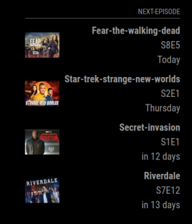
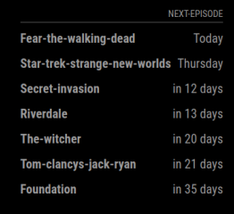
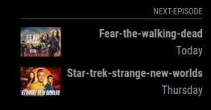
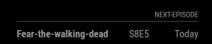

# MMM-next-episode

[MagicMirror²](https://magicmirror.builders/) module for tracking TV shows and movies provided from  [next-episode](https://next-episode.net/).

Track the TV shows and movies you watch.

Update your shows from the app for [Apple](https://apps.apple.com/se/app/next-episode-track-tv-shows/id347009526) and [Android](https://play.google.com/store/apps/details?id=net.nextepisode.android).

## Screenshots

 
 

## How to install

```bash
cd MagicMirror/modules
git clone https://github.com/PierreGode/MMM-next-episode
cd MMM-next-episode
npm install
```

## Configuration

In `~/MagicMirror/config/config.js`:

```js
{
  module: "MMM-next-episode",
  position: "bottom_right",
  header: "Next-Episode",
  config: {
    id: '',
    hash_key: '',
    displaySeasonAndEpisode: false,
    displayShowingOn: false,
    displayEpisodeName: false,
    maxdays: 7,
    ShowThumbnail: true,
    ThumbnailSize: 'small',
    updateInterval: 180
  }
},
```

### How to get your id and hash_key

When starting the module the first time without id and hash_key in the config, a QR code will be displayed on the mirror. Like this example:


Scan the QR code from your mirror and a empy page will show.

**Note: Edit the link and replace USERNAME and PASSWORD**.

On your device you have scanned the QR code with, edit the link and change only: USERNAME and PASSWORD with your login information for next-episode to get id and hash.

They might come together as a one line but the first 9 digits are the id and the rest is the hash.

**Note:** Using special characters such as '+', '"', '^', '%', '$', '#', in your password can cause the link to break. You may consider temporarily changing your password for this purpose.

After adding values `id` and `hash_key` in the config above, restart the MagicMirror.

### Config description

| name | values | info |
| --- | --- | --- |
| `id` | `YOUR ID` | Insert your ID. |
| `hash_key` | `YOUR HASHKEY` | Insert your hashkey. |
| `displaySeasonAndEpisode` | `true` or `false` | Show or hide season and episode. |
| `displayShowingOn` | `true` or `false` | Show or hide channel/service. |
| `displayEpisodeName` | `true` or `false` | Show or hide episode name. |
| `maxdays` | example: `300` |  Default `7`. How many days in the future to show shows from. minimum `0` but will always show Today and the next day. |
|`ShowThumbnail`| `true` or `false` | Show thumbnail of show or movie. |
|`ThumbnailSize`| `small`, `medium` or `large` | Change size of thumbnail. |
|`updateInterval`| example: `180` | 180 is default to update avery 3 hours and is the lowest time allowed, set theUpdate interval in minutes. |

## Changes

- Fixed show name display
- Added ability to show Channel/Service the show is airing on 
- Added ability to show/hide episode name

## Development

Developed and maintained by [Pierre Gode](https://github.com/PierreGode)

[](https://ko-fi.com/J3J2EARPK)

## Special Thanks

Big thanks to SANTAH from [next-episode](https://next-episode.net/) for building API support and providing information for this module.

The API is free, but feel free to support [next-episode](https://next-episode.net/).
